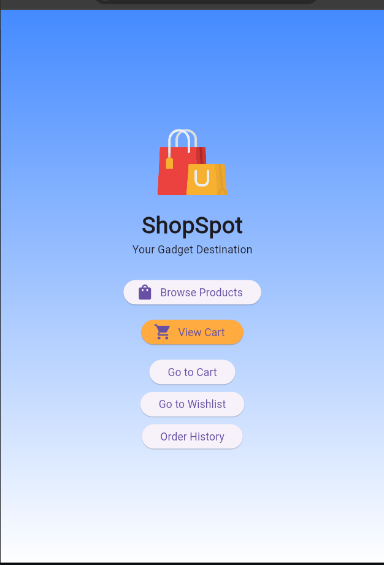
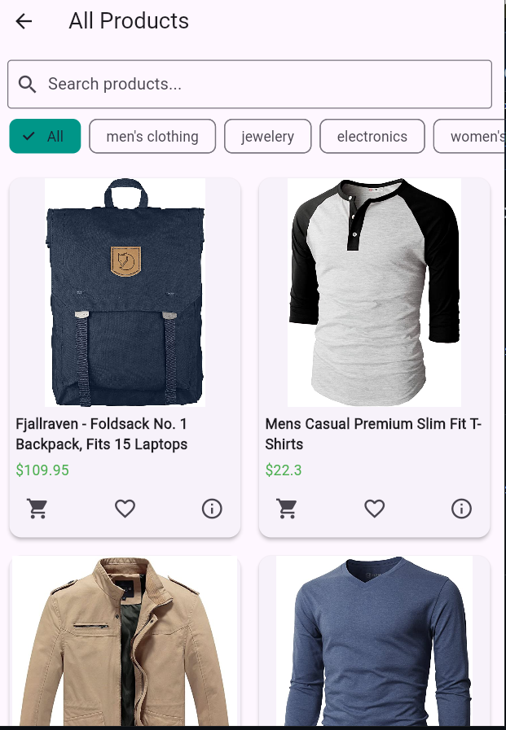
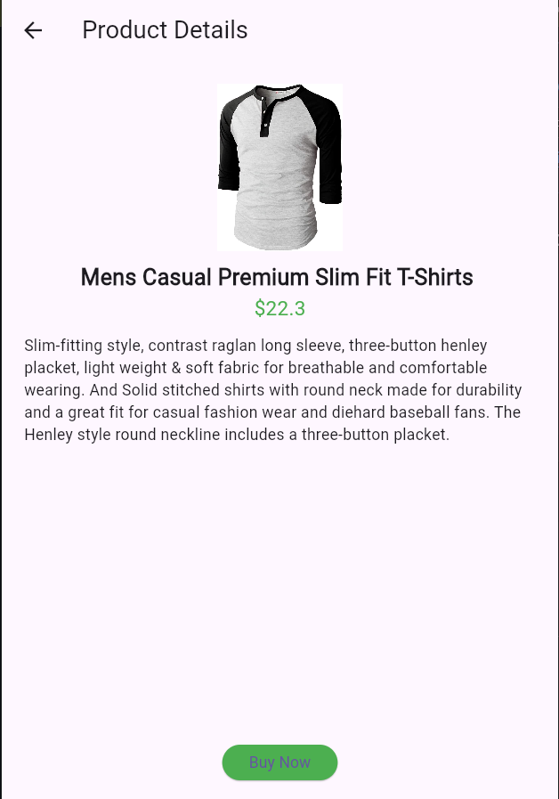
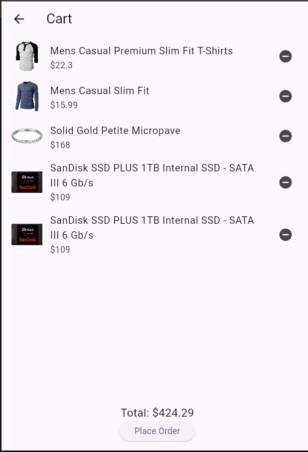
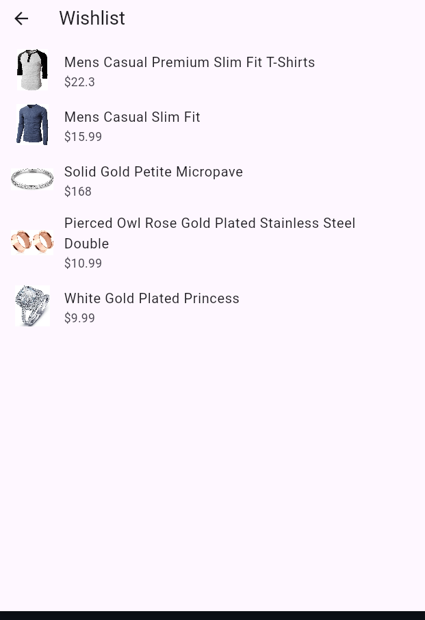
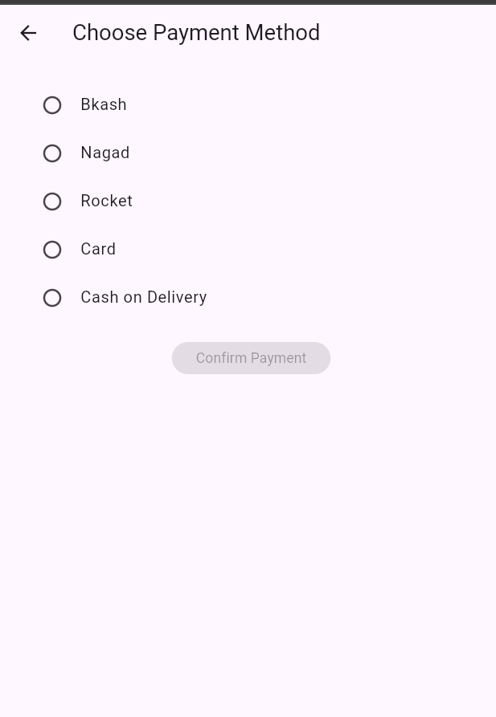
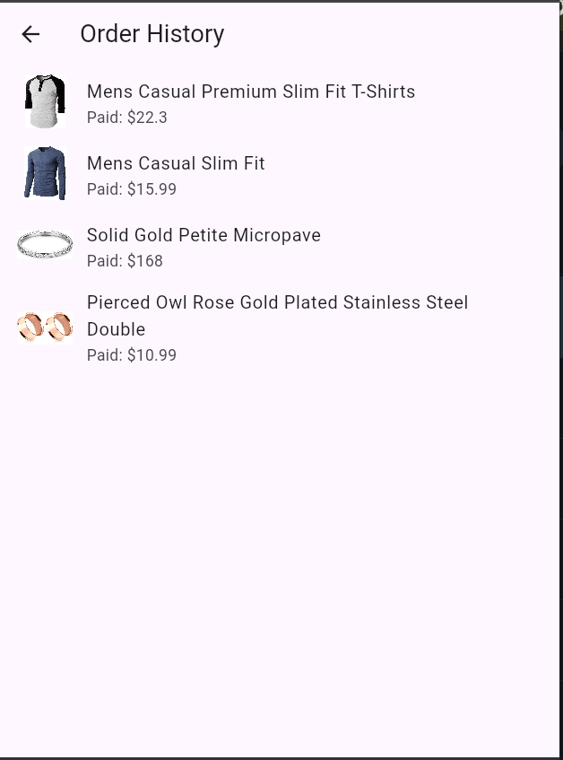

# 🛍️ ShopSpot – Flutter eCommerce App

ShopSpot is a full-featured eCommerce mobile app built with Flutter. It allows users to browse products, add them to cart or wishlist, proceed to payment, and track orders — all with a sleek UI and modern features like Dark Mode and Push Notifications.

---

## 📱 Features

- 🛒 Product Grid View with Category Chips & Search  
- ❤️ Wishlist and Cart Functionality with Toasts  
- 📦 Order Tracking with Status Updates  
- 💳 Razorpay Payment Integration (Mock/Real)  
- 🌙 Dark Mode Toggle  
- 🔔 Push Notifications using Firebase Messaging  
- ✨ Hero Animations & Responsive UI  

---

## 🖼️ Screenshots

| Home Page | Product List | Product Details |
|-----------|--------------|-----------------|
|  |  |  |

| Cart Page | Wishlist Page | Payment Page | Order History |
|-----------|---------------|---------------|----------------|
|  |  |  |  |

> 💡 Place your screenshots in a folder named `screenshots/` inside your project directory.

---

## 🔧 Installation

1. Clone the repository:
   ```bash
   git clone https://github.com/TRSiddique/flutter-project.git

✨ Developed by
Tasfiqur Rahman Siddique
University of Chittagong
Department of CSE

